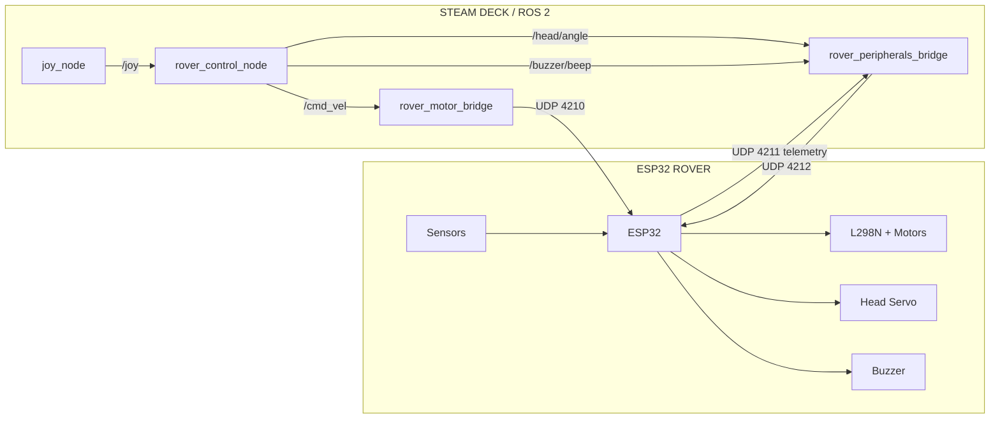
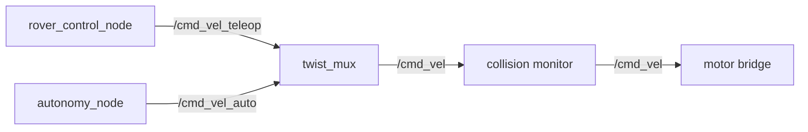
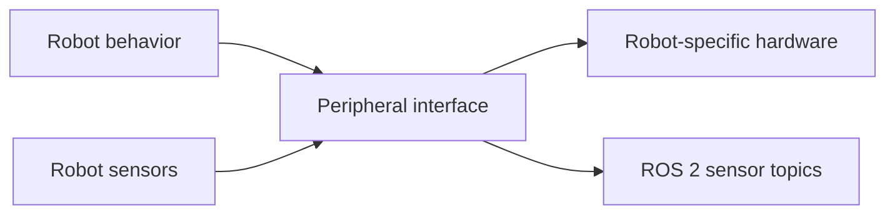

# Distributed ROS 2 Robotics Platform

A **distributed ROS 2 robotics platform** for building and controlling networked robots from a Steam Deck or similar Linux computer.

The project provides:

* Reusable ROS 2 interfaces for robotics control
* Template nodes for common robotics-control patterns
* A hardware-bridge architecture that separates ROS 2 behavior from robot-specific hardware
* Steam Deck-based robot control and visualization
* ESP32-based hardware integration
* A working four-wheel mecanum rover as the reference implementation

The goal is **not** to provide a universal robotics framework or a finished autonomous-robot stack.

Instead, this project establishes a reusable architecture and a set of working examples that can be adapted to different robots.

---

# What This Is

The basic idea is to keep **robot behavior and interfaces on the ROS 2 computer**, while allowing the actual robot hardware to be handled by separate microcontrollers and hardware-specific bridges.

```text
                    DISTRIBUTED ROS 2 PLATFORM
                              │
             ┌────────────────┴────────────────┐
             │                                 │
       STEAM DECK / ROS 2                ROBOT HARDWARE
             │                                 │
     ┌───────┴────────┐                  ESP32 / MCU
     │                │                  Motor drivers
  Templates       Reference nodes       Sensors / actuators
     │                │                       │
     └───────┬────────┘                       │
             │                                │
             └──────── Network / Bridge ──────┘
```

The Steam Deck acts as the robot's **ROS 2 computer**.

It handles things such as:

* Controller input
* Robot control logic
* ROS 2 interfaces
* Visualization
* Sensor processing
* Higher-level behaviors
* Future autonomy

The microcontroller handles the hardware-specific work:

* Motor control
* GPIO
* Sensors
* Servos
* Buzzers
* Hardware failsafes
* Low-level communication

This separation means the ROS 2 side does not need to know how a particular motor controller, GPIO pin, or microcontroller works.

---

# Why "Distributed"?

The system is distributed across multiple computing devices rather than putting the entire robot stack on a single controller.

For the reference rover:

```text
Steam Deck
    │
    │ ROS 2
    │
    ├── Controller input
    ├── Robot control
    ├── Command interfaces
    ├── Visualization
    └── Hardware bridges
             │
             │ Wi-Fi / UDP
             ▼
          ESP32
             │
       ┌─────┼─────┐
       ▼     ▼     ▼
    Motors  Sensors  Peripherals
```

The network boundary is therefore part of the architecture, but the platform does **not** require every robot to use the same network protocol.

ROS 2 interfaces are intended to be the reusable part.

Hardware protocols remain implementation-specific.

---

# Architecture

The project uses the current ESP32 mecanum rover as the **reference implementation** of the broader platform.

The important architectural boundary is:

```text
                 ROBOT PLATFORM
                       │
             ┌─────────┴─────────┐
             │                   │
        ROS 2 interfaces     Robot hardware
             │                   │
        behavior / commands    firmware
        sensor topics           drivers
        visualization           protocols
             │                   │
             └─────────┬─────────┘
                       │
                hardware bridge
```

The ROS 2 layer describes **what the robot should do**.

The hardware layer describes **how a particular robot actually does it**.

The bridges connect those two worlds.

---

# Current Reference Rover

The current reference robot is a four-wheel mecanum rover controlled by an ESP32.



This diagram represents the **current implementation**, not the future autonomous architecture.

The rover is important because it provides a complete working example of the platform's intended separation between:

1. ROS 2 control
2. Hardware bridges
3. Network communication
4. Microcontroller firmware
5. Physical hardware

---

# ROS 2 Control Nodes

## `rover_control_node`

This is the current rover's primary teleoperation/control node.

### Responsibilities

* Read `sensor_msgs/Joy`
* Implement arcade driving
* Implement tank driving
* Implement mecanum strafing
* Implement deadman behavior
* Implement turbo mode
* Toggle tank mode
* Generate head commands
* Generate buzzer commands

### ROS 2 interfaces

```text
Subscribe:
    /joy

Publish:
    /cmd_vel
    /head/angle
    /buzzer/beep
```

The current implementation is intentionally tied to the reference rover's controller layout and available control modes.

The **architecture is reusable**, but this particular node is not intended to be presented as a universal teleoperation package.

If another robot requires different controls, a different control node can implement the same general ROS 2 command concepts.

---

# `rover_motor_bridge`

The motor bridge is responsible for translating a ROS 2 velocity command into commands understood by the rover's motor hardware.

### Responsibilities

* Subscribe to `/cmd_vel`
* Apply mecanum kinematics
* Convert velocity to PWM values
* Apply minimum-PWM compensation
* Send drive packets to the ESP32
* Enforce a command timeout
* Send a stop packet during shutdown

### Current hardware protocol

```text
UDP 4210

FL,FR,RL,RR
```

The bridge is intentionally robot-specific.

A different robot could use a different bridge:

```text
Mecanum robot
    → mecanum motor bridge

Differential robot
    → differential motor bridge

Tracked robot
    → tracked motor bridge

Servo robot
    → servo actuator bridge
```

All of these can expose the appropriate ROS-facing interfaces while implementing completely different hardware underneath.

This is one of the main architectural boundaries of the project.

---

# `rover_peripherals_bridge`

The peripheral bridge handles non-drive hardware for the reference rover.

### Responsibilities

* Send head commands
* Send buzzer commands
* Receive telemetry
* Publish ultrasonic range data
* Publish raw telemetry

### Current hardware protocol

```text
UDP 4212
    HEAD,<angle>
    BUZZ,<hz>,<ms>

UDP 4211
    telemetry
```

This demonstrates the platform's general **peripheral bridge** pattern.

The implementation is still rover-specific because it knows about this rover's:

* Head
* Buzzer
* Ultrasonic sensor
* Telemetry format

A future robot can implement a different peripheral bridge without changing the overall architecture.

---

# Reusable ROS 2 Interfaces

A major design goal is to keep **ROS 2 interfaces stable while allowing hardware implementations to change**.

For example:

```text
/cmd_vel
```

means:

> Command the robot's base velocity.

It does **not** mean:

> Send this particular ESP32 UDP packet.

Likewise:

```text
/ultrasonic/range
```

describes a sensor observation rather than a particular HC-SR04 implementation.

This separation allows the hardware underneath an interface to change without forcing higher-level ROS 2 nodes to understand the hardware details.

---

# Templates

The repository contains generic node templates under:

```text
templates/
```

These are **architectural starting points**, not complete universal hardware drivers.

They are intentionally free of assumptions such as:

* Robot IP addresses
* UDP port assignments
* GPIO assignments
* Motor-driver hardware
* Specific sensors
* Specific controller mappings

The templates demonstrate how a new robot can fit into the platform.

The reference rover packages then provide the working, hardware-specific implementations.

---

# Future Command Architecture

The current rover is primarily teleoperated.

The planned architecture separates teleoperation from autonomous behavior:



This is a **future architecture**.

The current rover does not yet have `twist_mux`, an autonomy node, or collision monitoring in the control path.

The important design rule is that autonomy should operate at the **ROS 2 command level**.

An autonomy node should not need to know about:

* UDP ports
* PWM
* GPIO
* ESP32 firmware
* Motor-driver implementation

It should produce a robot command through the same ROS 2 interfaces used by the rest of the platform.

---

# Peripheral Architecture

The same separation applies to non-drive hardware.



A robot may have:

* A servo head
* A camera
* LEDs
* A buzzer
* An arm
* A gripper
* An IMU
* Ultrasonic sensors
* LiDAR
* Wheel encoders

The ROS 2 layer should expose useful interfaces without requiring other nodes to know how those devices are physically connected.

---

# Reference Rover Hardware

## Drive

The reference robot uses four-wheel mecanum drive with an X-pattern roller arrangement.

```text
FL ───────── FR
│             │
│   ROBOT     │
│             │
RL ───────── RR
```

### Mecanum kinematics

```text
fl = linear.x - linear.y - angular.z * wheel_separation / 2
fr = linear.x + linear.y + angular.z * wheel_separation / 2
rl = linear.x + linear.y - angular.z * wheel_separation / 2
rr = linear.x - linear.y + angular.z * wheel_separation / 2
```

These equations are part of the **reference rover's mecanum implementation**, not a requirement for every robot using the platform.

---

# Reference UDP Interfaces

The following network protocol belongs specifically to the current ESP32 rover.

```text
4210  Deck → Rover
      FL,FR,RL,RR

4211  Rover → Network
      Telemetry

4212  Deck → Rover
      HEAD,<angle>
      BUZZ,<hz>,<ms>
      RELEASE
```

These ports and packet formats are **implementation details**, not platform-wide requirements.

A future robot can use a different microcontroller, transport, protocol, or hardware architecture while exposing the appropriate ROS 2 interfaces.

---

# Roadmap

## 1. Core ROS 2 / Steam Deck Platform

**Status: Complete**

* ROS 2 Humble environment
* Steam Deck as robot computer
* Workspace and package structure
* Gamepad integration

## 2. Foxglove Integration

**Status: Complete**

* Foxglove Bridge
* ROS 2 topic visualization
* Steam Deck integration

A polished robot-specific sensor dashboard remains future work.

## 3. First ESP32 Robot

**Status: Complete**

* ESP32 firmware
* Wi-Fi connectivity
* OTA updates
* Robot hardware

## 4. UDP Robot Interface

**Status: Complete**

* Drive UDP channel
* Peripheral UDP channel
* Telemetry channel
* Hardware failsafes

## 5. Motor Control / Mecanum Drive

**Status: Complete**

* `/cmd_vel`
* Mecanum kinematics
* Four-wheel PWM output
* Minimum-PWM compensation
* Drive timeout

## 6. ROS 2 Teleoperation

**Status: Complete**

* Gamepad input
* Arcade mode
* Tank mode
* Mecanum strafing
* Deadman
* Turbo
* Mode switching

## 7. Peripheral Control & Telemetry

**Status: Complete**

* Head control
* Buzzer
* Ultrasonic range topic
* Raw telemetry
* Peripheral bridge

## 8. Head / Sensor Refinement

**Status: In Progress**

* Physical head calibration
* Sensor level calibration
* Sensor behavior refinement
* Telemetry improvements

## 9. Encoders & Odometry

**Status: Planned**

* Wheel encoders
* Wheel state
* Odometry
* `/odom`
* `/tf`
* `/joint_states`

## 10. Velocity Multiplexing / Autonomy

**Status: Planned**

* `twist_mux`
* Separate teleoperation and autonomy command sources
* Autonomous behavior node
* Mode management

## 11. Collision Monitoring

**Status: Planned**

* Sensor-aware velocity limiting
* Emergency stopping
* Hardware-independent collision layer

## 12. ROS 2 ↔ MQTT Integration

**Status: Planned**

MQTT will be used for **higher-level system integration**, rather than the real-time drive path.

Potential uses include:

* Home Assistant
* ESPHome
* Robot status
* Fleet state
* Higher-level commands

## 13. Multi-Robot Platform

**Status: Planned**

* Multiple robot namespaces
* Multiple hardware bridges
* Robot-specific configurations
* Shared autonomy infrastructure
* Fleet-level management

---

# Long-Term Architecture

The intended direction is to keep robot behavior, safety, and hardware implementation as separate layers.

```text
                    BEHAVIOR
                       │
          ┌────────────┴────────────┐
          │                         │
       TELEOP                    AUTONOMY
          │                         │
          └────────────┬────────────┘
                       ↓
                  /cmd_vel
                       ↓
               SAFETY / COLLISION
                       ↓
                ROBOT DRIVE API
                       ↓
              ROBOT-SPECIFIC BRIDGE
                       ↓
                    HARDWARE
```

The same principle applies to peripherals and sensors.

---

# What Is Reusable?

The project intentionally separates **platform concepts** from **reference-robot implementation**.

### Platform-level concepts

These are intended to be reusable:

* ROS 2 command interfaces
* ROS 2 sensor interfaces
* Hardware-bridge architecture
* Separation of behavior from hardware
* Template nodes
* Steam Deck as a ROS 2 robot computer
* Networked microcontroller architecture
* Future autonomy/safety command pipeline

### Reference-rover implementation

These currently belong specifically to the mecanum rover:

* Mecanum kinematics
* ESP32 firmware
* L298N motor control
* UDP ports `4210–4212`
* `FL,FR,RL,RR` packet format
* Head servo
* Buzzer
* Ultrasonic telemetry
* Current controller mappings

This distinction is intentional.

The rover is the first working robot built on the architecture, not the definition of the entire platform.

---

# Project Goal

The long-term goal is to make it possible to build different robots around a common ROS 2 architecture without forcing every robot to use the same hardware.

A future robot might be:

```text
ROS 2 / Steam Deck
        │
        ├── Teleoperation
        ├── Autonomy
        ├── Visualization
        └── Shared interfaces
                │
          Hardware bridge
                │
        ┌───────┴────────┐
        │                │
      ESP32            Other MCU
        │                │
     Rover A           Robot B
```

The software above the hardware bridge can remain largely consistent while the hardware implementation changes.

That is the core idea behind the platform:

> **Use ROS 2 to provide a common robotics interface, use templates to make that architecture easier to extend, and keep the actual hardware implementation specific to each robot.**

The current mecanum rover is the first complete implementation used to validate those boundaries.
