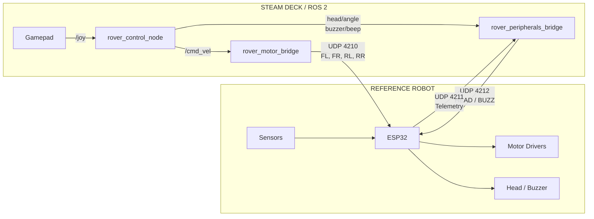

# Robotics Platform

A modular ROS 2 robotics platform built around a Steam Deck as the central robot computer and ESP32-based robots as hardware endpoints.

The current **ESP32 mecanum rover is the reference implementation**. The rover provides a working example of the platform while the ROS 2 interfaces and architectural patterns are intended to be reusable for future robots.

## Architecture

The platform separates robot behavior from hardware implementation.



The important boundary is between **ROS 2 interfaces** and **hardware implementation**.

A future robot does not need to use the same ESP32 firmware, UDP protocol, motor drivers, or sensors. It can implement the same ROS-facing concepts with completely different hardware.

## Current Reference Robot

The first robot is a four-wheel mecanum rover using an ESP32-WROOM-32.

### Hardware

* ESP32-WROOM-32
* 4 × TT gear motors
* 4 × mecanum wheels
* 2 × L298N motor drivers
* SG90 head servo
* HC-SR04 ultrasonic sensor
* 5-way TCRT5000L line sensor
* 2 × IR digital sensors
* Buzzer

### Motor mapping

| Wheel       | IN1 | IN2 |  LEDC |
| ----------- | --: | --: | ----: |
| Front Left  |  23 |  25 | 0 / 1 |
| Front Right |  26 |  27 | 2 / 3 |
| Rear Left   |  21 |  22 | 4 / 5 |
| Rear Right  |  18 |  19 | 6 / 7 |

## ROS 2 Nodes

### `rover_control_node`

Converts gamepad input into robot commands.

Current implementation supports:

* Arcade driving
* Tank driving
* Mecanum strafing
* Deadman control
* Turbo mode
* Tank-mode toggle
* Head swivel commands
* Buzzer commands

ROS interfaces:

```text
/joy
    ↓
rover_control_node
    ├── /cmd_vel
    ├── /head/angle
    └── /buzzer/beep
```

The control logic is currently rover/controller-specific, but the general pattern is reusable.

### `rover_motor_bridge`

Converts `/cmd_vel` into the rover's hardware-specific drive protocol.

Current implementation:

```text
/cmd_vel
    ↓
mecanum kinematics
    ↓
FL, FR, RL, RR PWM
    ↓
UDP 4210
    ↓
ESP32
```

The ROS `Twist` interface is reusable. The mecanum equations, PWM conversion, UDP protocol, and ESP32 implementation are specific to this rover.

### `rover_peripherals_bridge`

Handles non-drive robot functions.

Current implementation:

```text
/head/angle ────────┐
                    ├── rover_peripherals_bridge ── UDP 4212 ──→ ESP32
/buzzer/beep ───────┘

ESP32 ── UDP 4211 ──→ rover_peripherals_bridge
                           ├── /ultrasonic/range
                           └── /rover/telemetry_raw
```

This is the reference implementation of the platform's **peripheral interface pattern**.

The current UDP commands and telemetry format are rover-specific.

## Reusable vs Robot-Specific

The project intentionally separates reusable architecture from the implementation of the current robot.

### Reusable concepts

* ROS 2 `Twist` drive interface
* Gamepad → command-node architecture
* Autonomous behavior → velocity command architecture
* Peripheral command topics
* Sensor topic interfaces
* Hardware bridge pattern
* Command timeouts and hardware failsafes
* ROS 2 visualization/debugging
* Future velocity multiplexing
* Future collision monitoring
* Future multi-robot management

### Rover-specific implementation

* ESP32 firmware
* UDP ports
* UDP packet formats
* Mecanum wheel equations
* Wheel GPIO assignments
* L298N motor control
* PWM compensation
* SG90 head servo
* HC-SR04
* TCRT5000L
* IR sensors
* Current telemetry string format
* Current gamepad mapping

The current rover should therefore be treated as a **reference robot**, not as the definition of the entire platform.

## Generic Templates

Reusable architectural templates are kept under:

```text
templates/
```

These provide starting points for future robots without forcing them to copy the rover's hardware implementation.

The templates are intentionally incomplete hardware adapters. They define the ROS-facing structure while leaving the robot-specific implementation to the actual robot package.

## Repository

```text
robotics-platform/
├── README.md
│
├── docs/
│   ├── architecture-and-roadmap.md
│   ├── changelog.md
│   ├── controls.txt
│   └── ROVER_HANDOFF.md
│
├── templates/
│   ├── README.md
│   ├── robot_control_node.py
│   ├── robot_motor_bridge.py
│   └── robot_peripherals_bridge.py
│
├── firmware/
│   └── esp32-bot/
│
├── ros2/
│   ├── rover_control/
│   ├── rover_motor_bridge/
│   ├── rover_peripherals_bridge/
│   └── rover_description/
│
└── scripts/
```

## Current Status

The reference rover is operational under manual ROS 2 control.

Implemented:

* Steam Deck ROS 2 environment
* Gamepad input
* Manual teleoperation
* Arcade mode
* Tank mode
* Mecanum strafing
* Drive UDP interface
* ESP32 motor control
* Motor failsafe
* Head control
* Buzzer control
* Ultrasonic telemetry
* Basic sensor telemetry
* Peripheral UDP interface
* Foxglove ROS 2 integration
* OTA firmware support

Not yet implemented:

* Encoder feedback
* Odometry
* `tf`
* Autonomous behavior
* Velocity multiplexing
* Collision monitoring
* Full sensor visualization/dashboard
* ROS 2 ↔ MQTT integration
* Multi-robot management

## Development

ROS 2 workspace:

```text
~/Robotics/ros2_ws
```

Build:

```bash
cd ~/Robotics/ros2_ws
colcon build --symlink-install
```

Manual launch:

```bash
ros2 launch rover_control rover_control.launch.py
```

```bash
ros2 run rover_motor_bridge rover_motor_bridge --ros-args \
    -p max_linear_speed:=1.5 \
    -p min_pwm:=110
```

```bash
ros2 run rover_peripherals_bridge rover_peripherals_bridge
```

Foxglove connects through the ROS 2 bridge on the Steam Deck.

## Design Principle

The goal is not to build one increasingly complicated rover node.

The goal is to establish a **robot platform** where:

```text
robot behavior
      ↓
ROS 2 interfaces
      ↓
robot-specific hardware bridge
      ↓
hardware
```

The current rover proves that architecture with a real robot. Future robots can replace the hardware layer without requiring the entire ROS 2 system to be redesigned.
