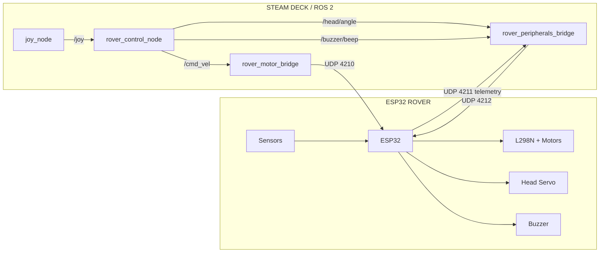
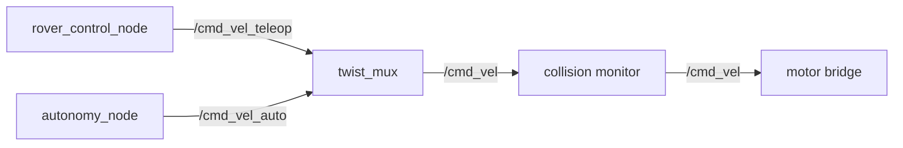
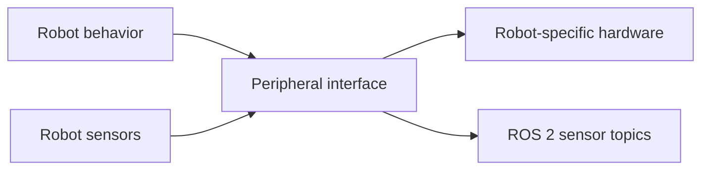

## Architecture

This project uses the current ESP32 mecanum rover as the **reference implementation** of a broader robot platform.

The important architectural boundary is:

```text
                 ROBOT PLATFORM
                       │
             ┌─────────┴─────────┐
             │                   │
        ROS 2 interfaces     Robot hardware
             │                   │
        behavior / commands    firmware
        sensor topics           drivers
        visualization           protocols
             │                   │
             └─────────┬─────────┘
                       │
                hardware bridge
```

The ROS 2 layer describes what the robot should do.

The hardware layer describes how a particular robot actually does it.

---

## Current Rover

The current reference robot is a four-wheel mecanum rover controlled by an ESP32.



This diagram represents the **current implementation**, not the future autonomous architecture.

---

# Node Responsibilities

## `rover_control_node`

Current responsibilities:

* Read `sensor_msgs/Joy`
* Implement arcade driving
* Implement tank driving
* Implement mecanum strafing
* Implement deadman behavior
* Implement turbo mode
* Toggle tank mode
* Generate head commands
* Generate buzzer commands

Current ROS interfaces:

```text
Subscribe:
    /joy

Publish:
    /cmd_vel
    /head/angle
    /buzzer/beep
```

The node is currently tightly coupled to the Steam Deck controller layout and the rover's available control modes.

The **architecture** is reusable, but this particular implementation should remain associated with the reference rover until another robot demonstrates a need for a generalized control package.

---

## `rover_motor_bridge`

Current responsibilities:

* Subscribe to `/cmd_vel`
* Apply mecanum kinematics
* Convert velocity to PWM values
* Apply minimum-PWM compensation
* Send drive packets to the ESP32
* Enforce a command timeout
* Send a stop packet during shutdown

Current hardware protocol:

```text
UDP 4210

FL,FR,RL,RR
```

The bridge is intentionally robot-specific.

A different robot should not necessarily reuse the mecanum implementation. For example:

```text
Mecanum robot
    → mecanum motor bridge

Differential robot
    → differential motor bridge

Tracked robot
    → tracked motor bridge

Servo robot
    → servo actuator bridge
```

They can all expose the same ROS-facing command interface while implementing different hardware below it.

---

## `rover_peripherals_bridge`

Current responsibilities:

* Send head commands
* Send buzzer commands
* Receive telemetry
* Publish ultrasonic range data
* Publish raw telemetry

Current hardware protocol:

```text
UDP 4212
    HEAD,<angle>
    BUZZ,<hz>,<ms>

UDP 4211
    telemetry
```

This node demonstrates the platform's general peripheral-bridge pattern.

The actual implementation is rover-specific because it knows about the rover's head, buzzer, ultrasonic sensor, and telemetry format.

---

# Reusable Platform Interfaces

The platform should favor stable ROS interfaces over stable hardware protocols.

For example:

```text
/cmd_vel
```

means:

> Command the robot's base velocity.

It should not mean:

> Send this particular ESP32 UDP packet.

Likewise:

```text
/ultrasonic/range
```

describes a sensor observation rather than a specific HC-SR04 implementation.

This allows the hardware underneath those interfaces to change.

---

# Future Command Architecture

Autonomy should not directly control the motor bridge.

The planned architecture is:



This is a **future architecture**.

The current rover does not yet have `twist_mux`, an autonomy node, or collision monitoring in the control path.

The important design rule is that autonomy should operate at the ROS 2 command level. It should not know about:

* UDP ports
* PWM
* GPIO
* ESP32 firmware
* motor-driver implementation

---

# Peripheral Architecture

The same separation applies to non-drive hardware.



A robot may have:

* a servo head
* a camera
* LEDs
* a buzzer
* an arm
* a gripper
* an IMU
* ultrasonic sensors
* LiDAR
* encoders

The ROS layer should expose useful interfaces without requiring other nodes to know how those devices are physically connected.

---

# Templates

The repository contains generic node templates under:

```text
templates/
```

These are architectural starting points rather than complete hardware drivers.

They deliberately omit:

* robot IP addresses
* UDP port assignments
* GPIO assignments
* motor-driver assumptions
* specific sensors
* specific controller mappings

The reference rover packages remain the working implementation.

---

# Reference Rover Hardware

## Drive

Four-wheel mecanum drive using an X-pattern roller arrangement.

```text
FL ───────── FR
│             │
│   ROBOT     │
│             │
RL ───────── RR
```

Kinematics:

```text
fl = linear.x - linear.y - angular.z * wheel_separation / 2
fr = linear.x + linear.y + angular.z * wheel_separation / 2
rl = linear.x + linear.y - angular.z * wheel_separation / 2
rr = linear.x - linear.y + angular.z * wheel_separation / 2
```

## Reference UDP interfaces

```text
4210  Deck → Rover
      FL,FR,RL,RR

4211  Rover → Network
      Telemetry

4212  Deck → Rover
      HEAD,<angle>
      BUZZ,<hz>,<ms>
      RELEASE
```

These are implementation details of the current rover, not platform-wide requirements.

---

# Roadmap

## 1. Core ROS 2 / Steam Deck Platform

**Status: Complete**

* ROS 2 Humble environment
* Steam Deck as robot computer
* Workspace and package structure
* Gamepad integration

## 2. Foxglove Integration

**Status: Complete**

* Foxglove Bridge
* ROS 2 topic visualization
* Steam Deck integration

A polished robot-specific sensor dashboard remains future work.

## 3. First ESP32 Robot

**Status: Complete**

* ESP32 firmware
* Wi-Fi connectivity
* OTA updates
* Robot hardware

## 4. UDP Robot Interface

**Status: Complete**

* Drive UDP channel
* Peripheral UDP channel
* Telemetry channel
* Hardware failsafes

## 5. Motor Control / Mecanum Drive

**Status: Complete**

* `/cmd_vel`
* Mecanum kinematics
* Four-wheel PWM output
* Minimum-PWM compensation
* Drive timeout

## 6. ROS 2 Teleoperation

**Status: Complete**

* Gamepad input
* Arcade mode
* Tank mode
* Mecanum strafing
* Deadman
* Turbo
* Mode switching

## 7. Peripheral Control & Telemetry

**Status: Complete**

* Head control
* Buzzer
* Ultrasonic range topic
* Raw telemetry
* Peripheral bridge

## 8. Head / Sensor Refinement

**Status: In Progress**

* Physical head calibration
* Sensor level calibration
* Sensor behavior refinement
* Telemetry improvements

## 9. Encoders & Odometry

**Status: Planned**

* Wheel encoders
* Wheel state
* Odometry
* `/odom`
* `/tf`
* `/joint_states`

## 10. Velocity Multiplexing / Autonomy

**Status: Planned**

* `twist_mux`
* Separate teleoperation and autonomy command sources
* Autonomous behavior node
* Mode management

## 11. Collision Monitoring

**Status: Planned**

* Sensor-aware velocity limiting
* Emergency stopping
* Hardware-independent collision layer

## 12. ROS 2 ↔ MQTT Integration

**Status: Planned**

MQTT will be used for higher-level system integration rather than the real-time drive path.

Potential uses:

* Home Assistant
* ESPHome
* Robot status
* Fleet state
* Higher-level commands

## 13. Multi-Robot Platform

**Status: Planned**

* Multiple robot namespaces
* Multiple hardware bridges
* Robot-specific configurations
* Shared autonomy infrastructure
* Fleet-level management

---

# Architectural Goal

The long-term architecture is:

```text
                    BEHAVIOR
                       │
          ┌────────────┴────────────┐
          │                         │
       TELEOP                    AUTONOMY
          │                         │
          └────────────┬────────────┘
                       ↓
                  /cmd_vel
                       ↓
               SAFETY / COLLISION
                       ↓
                ROBOT DRIVE API
                       ↓
              ROBOT-SPECIFIC BRIDGE
                       ↓
                    HARDWARE
```

The same principle applies to peripherals and sensors.

The current rover is the first implementation used to prove these boundaries. Future robots should reuse the ROS-facing architecture where appropriate while retaining their own hardware-specific bridges and firmware.
